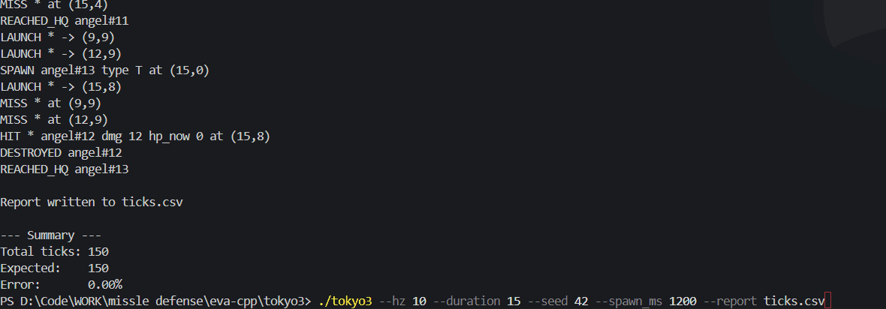

# Johnny Nguyen

**Computer Science | Purdue University**  
West Lafayette, IN  
Email: nguye875@purdue.edu  
LinkedIn: [linkedin.com/in/jnguyen727](https://linkedin.com/in/jnguyen727)  
GitHub: [github.com/jnguyen727](https://github.com/jnguyen727)

---

## About Me

Hi, I’m Johnny Nguyen, a proud first-generation Computer Science student from Fort Wayne, Indiana, studying at Purdue University on the Systems Programming track.  
I’m passionate about software engineering, particularly in systems and software related to defense, security, and aerospace technologies.  
My current focus lies in signal processing and the use of RF data for defense applications.

I’m currently conducting RF signal research through The Data Mine at Purdue University in collaboration with Raytheon Technologies.  
My work focuses on the classification and visualization of in-flight signals using GPU-accelerated Python pipelines and spectrogram analysis.  
[Read more about the project](https://crp.the-examples-book.com/rtx-classification-of-rf-signals-captured-in-flight-using-gpu-accelerated-python-scripts-54)

---

## Technical Skills

**Languages:** C++, C, Python, Java, JavaScript, HTML/CSS  
**Systems & Tools:** Linux, Git, GDB, Agile/Scrum  
**Data & Visualization:** NumPy, SciPy, TorchSig, Pandas, Hadoop, HiveQL, Matplotlib  
**Focus Areas:** Systems Programming, RF Signal Processing, Defense Software, Real-Time Simulation

---

## Experience

### The Data Mine at Purdue University & Raytheon Technologies (RTX)  
**Undergraduate Researcher — RF Simulation Team** | Aug 2025 – Present  
At The Data Mine at Purdue University, I collaborate with engineers from Raytheon Technologies (RTX) as part of the RF Simulation Team, where I develop and visualize synthetic RF signal datasets using TorchSig, NumPy, and SciPy. My work focuses on simulating and transforming RF data for signal classification models and supporting integration in an upcoming F-16 flight test.

### DegreeCat  
**Data Engineer Intern (Remote)** | Sep 2024 – Jan 2025  
As a Data Engineer Intern at DegreeCat, I built modular ETL pipelines in Python that standardized over 30,000 education records from multiple sources, cutting data cleaning time by 40% and enabling scalable analytics and dashboarding.

### Vincennes University  
**Head Early College Mathematics Tutor** | Mar 2024 – May 2024  
Previously, I served as Head Mathematics Tutor for the Early College Program at my high school, ran by Vincennes University, where I mentored first-generation students like myself, helping them strengthen mathematical understanding and academic confidence.

---

## Projects

### Bad Apple!! RF Spectrogram Renderer  
*Python, NumPy, SciPy, Matplotlib*  
- Rendered the “Bad Apple!!” PV entirely as RF-style spectrograms.  
- Translated image frames into frequency-domain signals using STFT-based pipelines.  
- Simulated frequency-aligned RF signals from 100 Hz and 12 kHz with real-time playback and visualization.

https://www.youtube.com/watch?v=PvIkpahSdOw
### NERV Missile Defense Simulator  
*C++, chrono, RNG*  
- Developed a terminal-based missile defense simulation with a deterministic 10–20 Hz tick-rate loop.  
- Implemented real-time entity management, collision logic, and efficient update cycles.  
- Designed allocation-free components for embedded-friendly performance.

---

## Education

**Purdue University**, West Lafayette, IN  
Bachelor of Science in Computer Science — GPA: 3.55 / 4.00  
*July 2024 – May 2027*  
Relevant Coursework: Data Structures & Algorithms, Computer Architecture, Discrete Math, C Programming, Object-Oriented Programming (Java), Big Data Analysis (Hadoop, HiveQL)

---
## Hobbies

Outside of class, here are some things I like
- Games (Overwatch 2, Rainbow Six Siege, osu!, Roblox)
- Listening to music
  [Spotify →](https://open.spotify.com/user/styliss0?si=86aa0a27294741fb)
- Anime and Manga [MyAnimeList](https://myanimelist.net/profile/Styliss) - email me about my list
- Bodybuilding (My split: Chest, Back, Arms, Legs, Rest, Repeat)
---

Currently seeking co-op and internship opportunities in defense, security, or systems software development.
