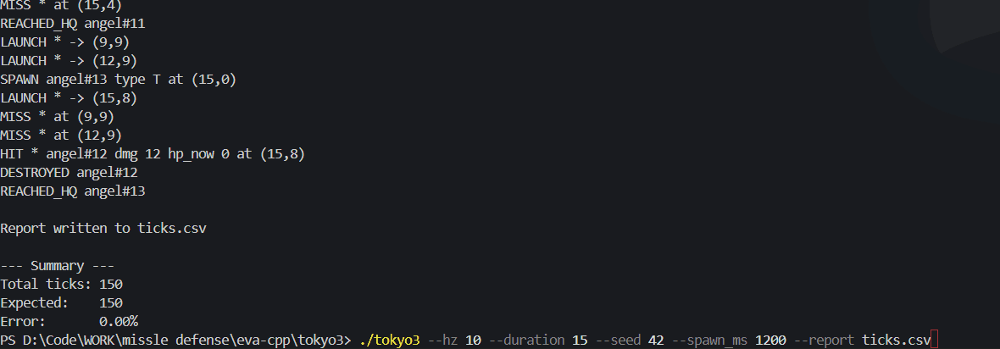

# Johnny Nguyen
**Computer Science | Purdue University**  
West Lafayette, IN  

---

## About Me

Hi, I'm Johnny, a first-generation Computer Science student from Fort Wayne, Indiana, studying at Purdue on the Systems Software track.

I'm drawn to low-level systems work and software related to defense, security, and aerospace. Right now I am in Albuqerque, NM interning at Sandia National Laboratories as part of the TITANS SW program doing R&D work on LLVM/Compilers.

---

## Technical Skills

**Languages:** C++, C, Java, Python, JavaScript, HTML/CSS  
**Systems & Tools:** Linux, Git, GDB, Valgrind, Flex/Bison, Bash, Make, fork/exec/pipe, signal handling, mutex/threading, Agile/Scrum  
**Data & Visualization:** NumPy, SciPy, TorchSig, Pandas, Hadoop, HiveQL, Matplotlib, Excel, PowerBI, Wireshark  

---

## Experience

### Sandia National Laboratories
**Software Engineering Intern, TITANS SW Program** | May 2026 – Aug 2026  
TITANS SW R&D intern working on LLVM/Compilers.

### The Data Mine at Purdue University & Raytheon Technologies (RTX)
**Undergraduate Researcher, RF Simulation Team** | Aug 2025 – May 2026  
Simulated RF signals using TorchSig, NumPy, and SciPy, applying transformations and distortions to improve data realism for downstream classification tasks. Generated and visualized time-frequency spectrograms to prepare datasets for signal classification models, collaborating in Agile sprints under RTX mentorship toward integration in F-16 jets for testing. Showcased a live demo of the project during a symposium at Purdue University.

### DegreeCat
**Data Engineer Intern (Remote)** | Sep 2024 – Jan 2025  
Cleaned and standardized 30k+ records from 10+ sources using Pandas, resolving schema inconsistencies and enabling downstream analytics and dashboarding. Designed modular ETL pipelines in Python that reduced data cleaning time by 40%.

### Vincennes University, Early College Program
**Head Mathematics Tutor** | Mar 2024 – May 2024  
Mentored first-generation college students in foundational mathematics, helping them build academic confidence during their transition to college coursework.

---

## Projects

### UNIX Shell Interpreter
*C++, Flex/Bison, Linux*
- Built a POSIX-style shell using Flex/Bison; implemented command execution via fork/execvp/waitpid, multi-stage pipe chaining with pipe()/dup2(), and full I/O redirection including stderr, append, and background (&) modes.
- Added subshell execution ($()), process substitution via mkfifo/mkdtemp, builtin commands (cd, setenv, source), .shellrc auto-sourcing, and environment variable/tilde/wildcard expansion using opendir/readdir and regcomp/regexec.
- Implemented SIGINT/SIGCHLD handlers for Ctrl-C and zombie reaping, a raw-mode line editor with cursor navigation and command history, and resolved all memory and file descriptor leaks via Valgrind.

---

### Bad Apple!! RF Spectrogram Renderer
*Python, NumPy, SciPy, Matplotlib*
- Animated the "Bad Apple!!" PV through spectrogram-based RF signal synthesis, translating each video frame into frequency-domain visualizations using STFT pipelines.
- Simulated frequency-aligned RF signals from image brightness data, achieving precise carrier mapping from 100 Hz to 12 kHz with real-time playback fidelity.

  
[Watch on YouTube](https://www.youtube.com/watch?v=PvIkpahSdOw)

---

### NERV Missile Defense Simulator
*C++, chrono, RNG*
- Terminal-based missile defense simulation with a deterministic 10-20 Hz tick-rate loop.
- Real-time entity management, collision detection, and efficient update cycles.
- Allocation-free component design targeting embedded-friendly performance.

---

## Education

**Purdue University**, West Lafayette, IN  
B.S. Computer Science, Systems Software Concentration | GPA: 3.57 / 4.00  
*July 2024 – May 2027*

Relevant Coursework: Systems Programming, Computer Security, Data Structures & Algorithms, Computer Architecture, Discrete Math, C Programming, OOP (Java), Big Data Analysis *(Hadoop, HiveQL, taken at Yonsei University)*

